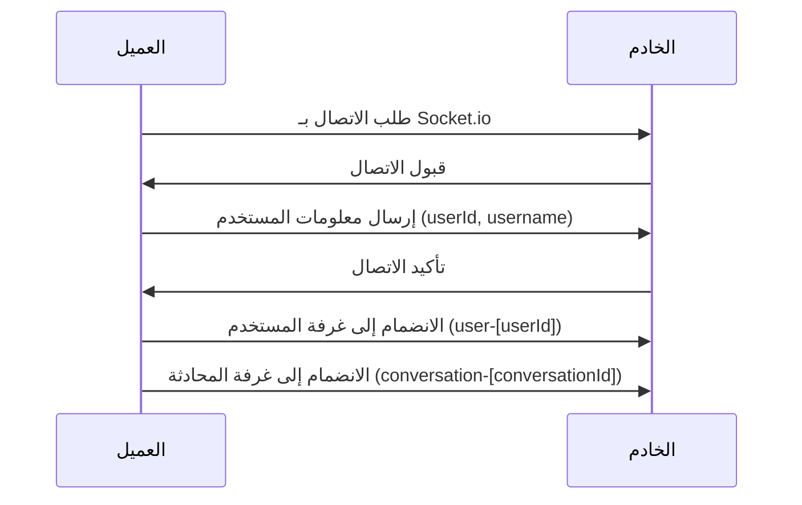
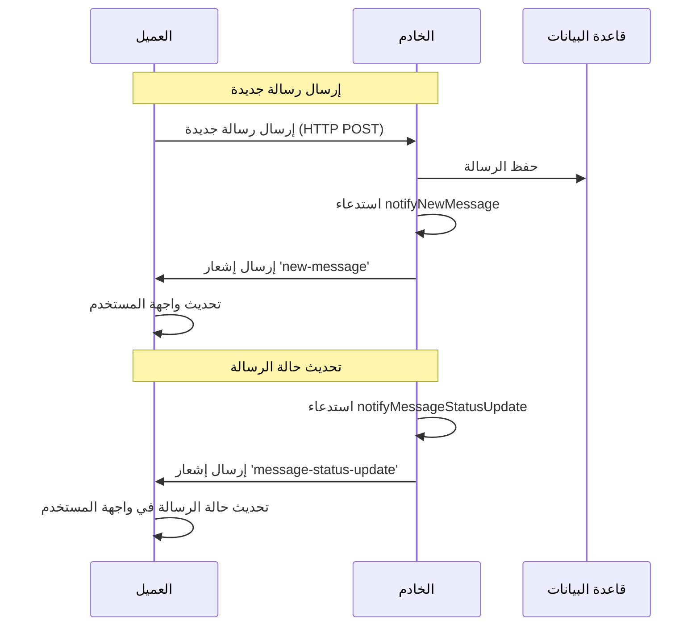
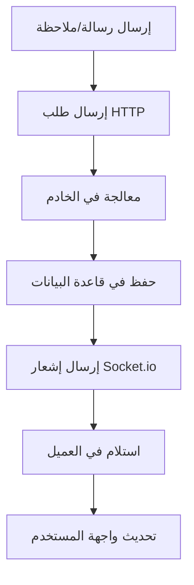

# توثيق نظام الإشعارات في تطبيق إدارة التراخيص

## نظرة عامة

نظام الإشعارات في التطبيق يعتمد على تقنية Socket.io لتوفير تحديثات فورية للمستخدمين. يتكون النظام من جزأين رئيسيين:

1. **جانب الخادم (Server-side)**: مسؤول عن إرسال الإشعارات إلى العملاء المتصلين.
2. **جانب العميل (Client-side)**: مسؤول عن استقبال الإشعارات وتحديث واجهة المستخدم.

## الملفات الرئيسية

### 1. جانب الخادم

- **`services/socketService.js`**: يحتوي على كل الوظائف المتعلقة بإدارة اتصالات Socket.io وإرسال الإشعارات.

### 2. جانب العميل

- **`public/js/notifications.js`**: يحتوي على وظائف تهيئة اتصال Socket.io واستقبال الإشعارات.
- **`public/js/socket-utils.js`**: يحتوي على وظائف مساعدة للتعامل مع اتصالات Socket.io.
- **`views/crm/conversations_split_ajax.ejs`**: يحتوي على كود الانضمام إلى غرف المحادثة.

## آلية عمل النظام

### 1. تهيئة الاتصال



### 2. إرسال واستقبال الإشعارات



## أنواع الإشعارات

| نوع الإشعار | الحدث في Socket.io | الوظيفة في الخادم | الاستخدام |
|------------|-------------------|-----------------|----------|
| رسالة جديدة | `new-message` | `notifyNewMessage` | إشعار بوصول رسالة جديدة |
| تحديث حالة الرسالة | `message-status-update` | `notifyMessageStatusUpdate` | تحديث حالة الرسالة (مرسلة، مستلمة، مقروءة) |
| رد على رسالة | `message-reply` | `notifyMessageReply` | إشعار برد على رسالة |
| تفاعل مع رسالة | `message-reaction` | `notifyMessageReaction` | إشعار بتفاعل مع رسالة |
| ملاحظة داخلية | `internal-note` | `notifyInternalNote` | إشعار بإضافة ملاحظة داخلية |
| تحديث المحادثة | `conversation-update` | `notifyConversationUpdate` | إشعار بتحديث بيانات المحادثة |

## غرف الإشعارات (Rooms)

النظام يستخدم مفهوم الغرف في Socket.io لتوجيه الإشعارات للمستخدمين المعنيين فقط:

1. **غرف المستخدمين**: `user-[userId]`
   - تستخدم للإشعارات الخاصة بمستخدم معين.
   - مثال: إشعارات المهام، الإشعارات الإدارية.

2. **غرف المحادثات**: `conversation-[conversationId]`
   - تستخدم للإشعارات المتعلقة بمحادثة معينة.
   - مثال: الرسائل الجديدة، تحديثات حالة الرسائل، الردود.

## آلية الانضمام إلى الغرف

### في جانب العميل

```javascript
// الانضمام إلى غرفة المحادثة
function joinConversationRoom(conversationId) {
    // إرسال طلب الانضمام
    emitSocketEvent('join', { room: `conversation-${conversationId}` });
    
    // مغادرة الغرفة السابقة
    if (window.previousConversationId && window.previousConversationId !== conversationId) {
        emitSocketEvent('leave', { room: `conversation-${window.previousConversationId}` });
    }
    
    // تحديث المتغيرات العامة
    window.currentConversationId = conversationId;
    window.previousConversationId = conversationId;
}
```

### في جانب الخادم

```javascript
// معالج الانضمام إلى غرفة
socket.on('join', (data) => {
    if (data && data.room) {
        socket.join(data.room);
        logger.info('socketService', 'انضمام إلى غرفة', { room: data.room, socketId: socket.id });
    }
});

// معالج مغادرة غرفة
socket.on('leave', (data) => {
    if (data && data.room) {
        socket.leave(data.room);
        logger.info('socketService', 'مغادرة غرفة', { room: data.room, socketId: socket.id });
    }
});
```

## آلية منع تكرار الرسائل والملاحظات

تم تصميم نظام منع تكرار الرسائل والملاحظات الداخلية باستخدام ثلاث طبقات من الفحص:

### 1. وحدانية مصدر الحقيقة (Single Source of Truth)

النظام الجديد يعتمد على **Socket.io كمصدر وحيد للحقيقة**، حيث:

- تم إزالة عمليات تحديث DOM المباشرة في وظائف `sendReply` و `addInternalNote`
- جميع تحديثات واجهة المستخدم تأتي حصرًا من إشعارات Socket.io
- تم توحيد مسار معالجة الرسائل والملاحظات 



### 2. آلية تتبع المعرفات

يستخدم النظام تتبع معرفات الرسائل والملاحظات المرسلة باستخدام مجموعات (Sets):

- `window.sentMessageIds`: لتتبع معرفات الرسائل
- `window.sentNoteIds`: لتتبع معرفات الملاحظات الداخلية

هذه المجموعات تمنع معالجة نفس الرسالة أو الملاحظة أكثر من مرة.

### 3. فحوصات متعددة لمنع التكرار

كل رسالة أو ملاحظة تمر بمراحل فحص متعددة:

1. **فحص وجود العنصر في DOM**: التحقق من وجود عنصر بنفس المعرف في واجهة المستخدم
2. **فحص المعرفات المخزنة**: التحقق من وجود المعرف في مجموعة المعرفات المرسلة
3. **إضافة المعرفات الجديدة**: إضافة المعرف إلى مجموعة المعرفات لمنع التكرار المستقبلي

```javascript
// مثال لمنع تكرار الرسائل
// 1. التحقق من وجود الرسالة في الواجهة بالفعل
const existingMessage = document.querySelector(`[data-message-id="${message._id}"]`);
if (existingMessage) return;

// 2. التحقق من وجود الرسالة في قائمة الرسائل المرسلة
if (window.sentMessageIds && window.sentMessageIds.has(message._id)) return;

// 3. إضافة معرف الرسالة إلى قائمة الرسائل المرسلة
window.sentMessageIds.add(message._id);
```

## أفضل الممارسات

1. **استخدام الوظائف المساعدة**: استخدم دائمًا الوظائف المساعدة في `socket-utils.js` للتعامل مع Socket.io.
2. **التحقق من حالة الاتصال**: استخدم `isSocketConnected()` للتحقق من حالة الاتصال قبل محاولة إرسال أي إشعارات.
3. **تخزين العمليات المهمة**: استخدم `emitSocketEvent()` مع تحديد `important=true` للعمليات المهمة التي يجب تنفيذها حتى بعد استعادة الاتصال.
4. **إدارة الغرف بشكل صحيح**: تأكد من مغادرة الغرف غير المستخدمة لتجنب تسرب الذاكرة.
5. **اعتماد Socket.io كمصدر وحيد للحقيقة**: لا تقم بتحديث واجهة المستخدم مباشرة عند إرسال رسائل أو ملاحظات، بل انتظر إشعارات Socket.io.
6. **استخدام آليات منع التكرار**: تأكد من استخدام وحدات تتبع المعرفات (`window.sentMessageIds` و `window.sentNoteIds`) لمنع تكرار الرسائل والملاحظات.
7. **تسجيل أخطاء المزامنة**: استخدم `console.log` أو `console.error` لتسجيل أي مشاكل في مزامنة الرسائل لتسهيل التشخيص.

## الأخطاء الشائعة وحلولها

1. **عدم وصول الإشعارات**:
   - تأكد من الانضمام إلى الغرفة الصحيحة.
   - تحقق من حالة اتصال Socket.io.
   - تأكد من تسجيل مستمع الحدث المناسب.

2. **تكرار الإشعارات**:
   - تأكد من أن آلية منع التكرار تعمل بشكل صحيح.
   - تحقق من عدم وجود تحديثات DOM مباشرة تتجاوز نظام Socket.io.
   - تأكد من تهيئة مجموعات `window.sentMessageIds` و `window.sentNoteIds` بشكل صحيح.
   - استخدم وسائل التصحيح (logging) المناسبة لتتبع الرسائل المكررة.

3. **تأخر الإشعارات**:
   - تحقق من أداء الخادم وقاعدة البيانات.
   - تأكد من عدم وجود عمليات كثيرة تعيق أداء Socket.io.

4. **فقدان تزامن الرسائل**:
   - تحقق من أن جميع العملاء يستخدمون نفس آلية منع التكرار.
   - تأكد من أن الخادم يقوم بإرسال الإشعارات إلى جميع العملاء المتصلين بالغرفة.
   - افحص ما إذا كانت هناك مشكلات في الاتصال تؤثر على نقل الإشعارات.

## تشخيص مشاكل تكرار الرسائل

إذا استمرت مشكلة تكرار الرسائل أو الملاحظات، يمكن استخدام الخطوات التالية للتشخيص:

1. **التحقق من سجلات وحدة التحكم**:
   ```javascript
   // تمكين وضع التصحيح المفصل
   window.DEBUG_MESSAGES = true;
   ```

2. **التحقق من مجموعات المعرفات**:
   ```javascript
   // طباعة جميع معرفات الرسائل المرسلة
   console.log('sentMessageIds:', Array.from(window.sentMessageIds));
   ```

3. **التحقق من الرسائل الحالية في DOM**:
   ```javascript
   // طباعة جميع معرفات الرسائل الموجودة في DOM
   console.log('DOM message IDs:', 
     Array.from(document.querySelectorAll('[data-message-id]'))
       .map(el => el.dataset.messageId)
   );
   ```

4. **مراقبة إشعارات Socket.io باستخدام معترض**:
   ```javascript
   // تسجيل جميع إشعارات Socket.io
   const originalOn = socket.on;
   socket.on = function(event, handler) {
     return originalOn.call(this, event, function(data) {
       console.log(`Socket.io event: ${event}`, data);
       return handler.apply(this, arguments);
     });
   };
   ```

## ملاحظات هامة

1. نظام الإرسال يعتمد على HTTP للإرسال الفعلي للرسائل الجديدة والردود والتفاعلات.
2. Socket.io يستخدم فقط للإشعارات والتحديثات المباشرة.
3. المسارات الرئيسية للإرسال:
   - الرسائل الجديدة: `POST /crm/conversations/:conversationId`
   - الردود: `POST /crm/conversations/:conversationId/reply`
   - التفاعلات: `POST /crm/conversations/:conversationId/reaction`

## بنية البيانات المرسلة

### 1. رسالة جديدة (new-message)

```javascript
{
    _id: "67eff652499c1a171653a3ef",
    conversationId: "67eeb804c3be33804b8a0683",
    text: "نص الرسالة",
    sender: {
        _id: "6657876e95a2d26a495b3559",
        username: "admin"
    },
    timestamp: "2025-04-04T15:10:10.200Z",
    status: "sent",
    mediaType: "image", // اختياري، في حالة وجود وسائط
    mediaUrl: "https://example.com/image.jpg" // اختياري، في حالة وجود وسائط
}
```

### 2. تحديث حالة الرسالة (message-status-update)

```javascript
{
    externalId: "wamid.HBgLNDY3MjM2MzYwNjEVAgARGBI3RkFFQUE4MzIwODAyRDg0OTUA",
    status: "delivered", // أو "sent", "read"
    conversationId: "67eeb804c3be33804b8a0683"
}
```

### 3. ملاحظة داخلية (internal-note)

```javascript
{
    _id: "67f0234fb6c481e919e6f4a2",
    conversationId: "67eeb804c3be33804b8a0683",
    text: "نص الملاحظة الداخلية",
    author: {
        _id: "6657876e95a2d26a495b3559",
        username: "admin"
    },
    timestamp: "2025-04-04T18:05:32.120Z",
    isInternalNote: true
}
```

## تحسين تجربة إرسال الرسائل المتعددة

في التحديث الجديد، تم تطبيق التحسينات التالية لإتاحة إمكانية إرسال رسائل متعددة دون انتظار اكتمال إرسال الرسائل السابقة:

1. **تفريغ حقل النص الفوري**:
   - تفريغ حقل النص مباشرة بعد الضغط على الإرسال
   - إزالة تعطيل زر الإرسال أثناء عملية الإرسال
   - السماح للمستخدم بكتابة رسائل متعددة متتالية

2. **عرض الرسائل قيد الإرسال**:
   - إنشاء رسالة مؤقتة بمعرف فريد تبدأ بـ `pending_`
   - عرض حالة مرئية (أيقونة ساعة ومؤشر متحرك) للرسائل قيد الإرسال
   - تمييز الرسائل الفاشلة بتنسيق مختلف

3. **آلية استبدال الرسائل المؤقتة**:
   - استخدام `window.pendingMessageMapping` لتخزين العلاقة بين المعرفات المؤقتة والحقيقية
   - تحديث الرسائل المؤقتة في الواجهة بمجرد استلام الرسالة الحقيقية من الخادم
   - استبدال الرسائل المؤقتة بالرسائل الحقيقية بدلاً من إضافة رسائل جديدة

### مثال لبنية البيانات للرسائل المؤقتة:

```javascript
// تخزين معرفات الرسائل المؤقتة والحقيقية
window.pendingMessageMapping = {
    "pending_1617283945123": "67f0a8deb44f99d80e5b9a33",
    "pending_1617283946456": "67f0a8e0c55e23f91a6c8b44"
};

// تخزين جميع معرفات الرسائل المرسلة لمنع التكرار
window.sentMessageIds = new Set([
    "pending_1617283945123",
    "pending_1617283946456",
    "67f0a8deb44f99d80e5b9a33",
    "67f0a8e0c55e23f91a6c8b44"
]);
```

### أنماط CSS للرسائل قيد الإرسال:

تم إضافة أنماط خاصة في ملف `conversation.css` للرسائل قيد الإرسال والرسائل الفاشلة:

```css
/* أنماط للرسائل قيد الإرسال */
.message-pending {
  position: relative;
}

.message-pending .message-bubble {
  opacity: 0.8;
  background: linear-gradient(135deg, #8cb5ff, #5f91d1);
}

.message-pending::after {
  content: '';
  position: absolute;
  bottom: 0;
  left: 0;
  width: 100%;
  height: 2px;
  background: linear-gradient(to right, transparent, #007bff, transparent);
  animation: pendingAnimation 1.5s infinite;
}

.message-failed .message-bubble {
  background: linear-gradient(135deg, #ff8c8c, #d15f5f);
}

@keyframes pendingAnimation {
  0% { opacity: 0; }
  50% { opacity: 1; }
  100% { opacity: 0; }
}
```

## التوافق مع التعديلات السابقة

هذه التحسينات الجديدة تحافظ على توافقها مع جميع التعديلات السابقة:

1. نظام منع تكرار الرسائل
2. التكامل مع نظام الوسائط في واتساب
3. آلية تتبع حالة الرسائل وتحديثها

كما أنها تعزز تجربة المستخدم من خلال السماح بالإرسال السريع للرسائل المتعددة دون انتظار، مع الحفاظ على عرض مرئي واضح لحالة كل رسالة.

## ملخص التغييرات الأخيرة

في التحديث الأخير، تم إجراء التغييرات التالية لحل مشكلة تكرار الرسائل والملاحظات:

1. **إزالة التحديث المزدوج للواجهة**:
   - إزالة التحديث المباشر في `conversation-utils.js` (دالة `sendReply`)
   - إزالة التحديث المباشر في `conversation-notes-utils.js` (دالة `addInternalNote`)
   - الاعتماد حصرًا على إشعارات Socket.io لتحديث الواجهة

2. **تحسين آلية منع التكرار**:
   - تنفيذ فحص متعدد المستويات للرسائل والملاحظات الداخلية
   - استخدام `window.sentMessageIds` و `window.sentNoteIds` لتتبع العناصر المرسلة
   - تحسين التسجيل (logging) لتسهيل تشخيص المشكلات

3. **تنظيم الشيفرة**:
   - توحيد طريقة معالجة الرسائل والملاحظات الداخلية
   - إضافة تعليقات توضيحية أفضل
   - تحسين التنظيم العام للوظائف المتعلقة بالإشعارات

## التعامل مع حالات الاتصال

النظام يتعامل مع مختلف حالات الاتصال بـ Socket.io:

1. **الاتصال الناجح**: يتم تسجيل حالة الاتصال وتنفيذ العمليات المعلقة.
2. **فقدان الاتصال**: يتم تسجيل حالة قطع الاتصال وتحديث المتغيرات العامة.
3. **إعادة الاتصال**: يتم تحديث حالة الاتصال وتحديث المحتوى الحالي.

### آلية تخزين العمليات المعلقة

في حالة عدم توفر اتصال Socket.io، يتم تخزين العمليات في مصفوفة `window.pendingSocketOperations` وتنفيذها عند استعادة الاتصال:

```javascript
// تخزين عملية للتنفيذ لاحقًا
window.pendingSocketOperations.push((socket) => {
    socket.emit('join', { room: `conversation-${conversationId}` });
});

// تنفيذ العمليات المعلقة عند استعادة الاتصال
window.pendingSocketOperations.forEach(operation => {
    if (typeof operation === 'function') {
        operation(socket);
    }
});
```

## التكامل مع نظام الوسائط

نظام الإشعارات يدعم التكامل الكامل مع نظام الوسائط في واتساب، حيث:

1. يتم إرسال إشعارات للرسائل التي تحتوي على وسائط (صور، فيديو، صوت، مستندات)
2. تحمل الإشعارات معلومات إضافية عن نوع الوسائط والرابط
3. يتم تحديث واجهة المستخدم لعرض الوسائط المناسبة

### مثال لإشعار رسالة بوسائط

```javascript
{
    _id: "67f0234fb6c481e919e6f4a3",
    conversationId: "67eeb804c3be33804b8a0683",
    mediaType: "image",
    mediaUrl: "https://example.com/image.jpg",
    caption: "وصف اختياري للصورة",
    mimeType: "image/jpeg",
    fileSize: 128000, // بالبايت
    sender: {
        _id: "6657876e95a2d26a495b3559",
        username: "admin"
    },
    timestamp: "2025-04-04T18:06:44.450Z",
    status: "sent"
}
```

## تحسين نظام الأصوات والإشعارات

تم تحسين نظام تشغيل أصوات الإشعارات لتجنب الإزعاج وتحسين تجربة المستخدم من خلال:

1. **تشغيل الصوت للرسائل الواردة فقط**:
   - تعديل التحقق في الحدث `new-message` ليتضمن شرط `message.direction === 'incoming'`
   - تعديل التحقق في الحدث `message-updated` بنفس الشرط
   - منع تشغيل صوت الإشعار للرسائل الصادرة التي تم إرسالها من قبل المستخدم نفسه

2. **تشغيل الصوت للملاحظات الداخلية بشكل انتقائي**:
   - تشغيل صوت الإشعار للملاحظات الداخلية فقط إذا كانت من مستخدم آخر (وليس المستخدم الحالي)
   - استخدام شرط `note.author._id !== window.currentUserId` للتحقق

هذه التحسينات تجعل نظام الإشعارات أكثر ذكاءً وتراعي سياق المستخدم، حيث لا يتم إزعاج المستخدم بأصوات إشعار للرسائل التي قام بإرسالها بنفسه.

```javascript
// مثال للكود المعدّل لتشغيل صوت الإشعار
if (typeof window.playNotificationSound === 'function' && message.direction === 'incoming') {
    window.playNotificationSound();
}
```

## ملخص التغييرات الأخيرة

في التحديث الأخير، تم إجراء التغييرات التالية لحل مشكلة تكرار الرسائل والملاحظات:

1. **إزالة التحديث المزدوج للواجهة**:
   - إزالة التحديث المباشر في `conversation-utils.js` (دالة `sendReply`)
   - إزالة التحديث المباشر في `conversation-notes-utils.js` (دالة `addInternalNote`)
   - الاعتماد حصرًا على إشعارات Socket.io لتحديث الواجهة

2. **تحسين آلية منع التكرار**:
   - تنفيذ فحص متعدد المستويات للرسائل والملاحظات الداخلية
   - استخدام `window.sentMessageIds` و `window.sentNoteIds` لتتبع العناصر المرسلة
   - تحسين التسجيل (logging) لتسهيل تشخيص المشكلات

3. **تنظيم الشيفرة**:
   - توحيد طريقة معالجة الرسائل والملاحظات الداخلية
   - إضافة تعليقات توضيحية أفضل
   - تحسين التنظيم العام للوظائف المتعلقة بالإشعارات

## ملخص التغييرات الأخيرة

في التحديث الأخير، تم إجراء التغييرات التالية لحل مشكلة تكرار الرسائل والملاحظات:

1. **إزالة التحديث المزدوج للواجهة**:
   - إزالة التحديث المباشر في `conversation-utils.js` (دالة `sendReply`)
   - إزالة التحديث المباشر في `conversation-notes-utils.js` (دالة `addInternalNote`)
   - الاعتماد حصرًا على إشعارات Socket.io لتحديث الواجهة

2. **تحسين آلية منع التكرار**:
   - تنفيذ فحص متعدد المستويات للرسائل والملاحظات الداخلية
   - استخدام `window.sentMessageIds` و `window.sentNoteIds` لتتبع العناصر المرسلة
   - تحسين التسجيل (logging) لتسهيل تشخيص المشكلات

3. **تنظيم الشيفرة**:
   - توحيد طريقة معالجة الرسائل والملاحظات الداخلية
   - إضافة تعليقات توضيحية أفضل
   - تحسين التنظيم العام للوظائف المتعلقة بالإشعارات

## التعامل مع حالات الاتصال

النظام يتعامل مع مختلف حالات الاتصال بـ Socket.io:

1. **الاتصال الناجح**: يتم تسجيل حالة الاتصال وتنفيذ العمليات المعلقة.
2. **فقدان الاتصال**: يتم تسجيل حالة قطع الاتصال وتحديث المتغيرات العامة.
3. **إعادة الاتصال**: يتم تحديث حالة الاتصال وتحديث المحتوى الحالي.

### آلية تخزين العمليات المعلقة

في حالة عدم توفر اتصال Socket.io، يتم تخزين العمليات في مصفوفة `window.pendingSocketOperations` وتنفيذها عند استعادة الاتصال:

```javascript
// تخزين عملية للتنفيذ لاحقًا
window.pendingSocketOperations.push((socket) => {
    socket.emit('join', { room: `conversation-${conversationId}` });
});

// تنفيذ العمليات المعلقة عند استعادة الاتصال
window.pendingSocketOperations.forEach(operation => {
    if (typeof operation === 'function') {
        operation(socket);
    }
});
```

## التكامل مع نظام الوسائط

نظام الإشعارات يدعم التكامل الكامل مع نظام الوسائط في واتساب، حيث:

1. يتم إرسال إشعارات للرسائل التي تحتوي على وسائط (صور، فيديو، صوت، مستندات)
2. تحمل الإشعارات معلومات إضافية عن نوع الوسائط والرابط
3. يتم تحديث واجهة المستخدم لعرض الوسائط المناسبة

### مثال لإشعار رسالة بوسائط

```javascript
{
    _id: "67f0234fb6c481e919e6f4a3",
    conversationId: "67eeb804c3be33804b8a0683",
    mediaType: "image",
    mediaUrl: "https://example.com/image.jpg",
    caption: "وصف اختياري للصورة",
    mimeType: "image/jpeg",
    fileSize: 128000, // بالبايت
    sender: {
        _id: "6657876e95a2d26a495b3559",
        username: "admin"
    },
    timestamp: "2025-04-04T18:06:44.450Z",
    status: "sent"
}
```

## تحسين نظام الأصوات والإشعارات

تم تحسين نظام تشغيل أصوات الإشعارات لتجنب الإزعاج وتحسين تجربة المستخدم من خلال:

1. **تشغيل الصوت للرسائل الواردة فقط**:
   - تعديل التحقق في الحدث `new-message` ليتضمن شرط `message.direction === 'incoming'`
   - تعديل التحقق في الحدث `message-updated` بنفس الشرط
   - منع تشغيل صوت الإشعار للرسائل الصادرة التي تم إرسالها من قبل المستخدم نفسه

2. **تشغيل الصوت للملاحظات الداخلية بشكل انتقائي**:
   - تشغيل صوت الإشعار للملاحظات الداخلية فقط إذا كانت من مستخدم آخر (وليس المستخدم الحالي)
   - استخدام شرط `note.author._id !== window.currentUserId` للتحقق

هذه التحسينات تجعل نظام الإشعارات أكثر ذكاءً وتراعي سياق المستخدم، حيث لا يتم إزعاج المستخدم بأصوات إشعار للرسائل التي قام بإرسالها بنفسه.

```javascript
// مثال للكود المعدّل لتشغيل صوت الإشعار
if (typeof window.playNotificationSound === 'function' && message.direction === 'incoming') {
    window.playNotificationSound();
}
```

## ملخص التغييرات الأخيرة

في التحديث الأخير، تم إجراء التغييرات التالية لحل مشكلة تكرار الرسائل والملاحظات:

1. **إزالة التحديث المزدوج للواجهة**:
   - إزالة التحديث المباشر في `conversation-utils.js` (دالة `sendReply`)
   - إزالة التحديث المباشر في `conversation-notes-utils.js` (دالة `addInternalNote`)
   - الاعتماد حصرًا على إشعارات Socket.io لتحديث الواجهة

2. **تحسين آلية منع التكرار**:
   - تنفيذ فحص متعدد المستويات للرسائل والملاحظات الداخلية
   - استخدام `window.sentMessageIds` و `window.sentNoteIds` لتتبع العناصر المرسلة
   - تحسين التسجيل (logging) لتسهيل تشخيص المشكلات

3. **تنظيم الشيفرة**:
   - توحيد طريقة معالجة الرسائل والملاحظات الداخلية
   - إضافة تعليقات توضيحية أفضل
   - تحسين التنظيم العام للوظائف المتعلقة بالإشعارات

## التعامل مع حالات الاتصال

النظام يتعامل مع مختلف حالات الاتصال بـ Socket.io:

1. **الاتصال الناجح**: يتم تسجيل حالة الاتصال وتنفيذ العمليات المعلقة.
2. **فقدان الاتصال**: يتم تسجيل حالة قطع الاتصال وتحديث المتغيرات العامة.
3. **إعادة الاتصال**: يتم تحديث حالة الاتصال وتحديث المحتوى الحالي.

### آلية تخزين العمليات المعلقة

في حالة عدم توفر اتصال Socket.io، يتم تخزين العمليات في مصفوفة `window.pendingSocketOperations` وتنفيذها عند استعادة الاتصال:

```javascript
// تخزين عملية للتنفيذ لاحقًا
window.pendingSocketOperations.push((socket) => {
    socket.emit('join', { room: `conversation-${conversationId}` });
});

// تنفيذ العمليات المعلقة عند استعادة الاتصال
window.pendingSocketOperations.forEach(operation => {
    if (typeof operation === 'function') {
        operation(socket);
    }
});
```

## التكامل مع نظام الوسائط

نظام الإشعارات يدعم التكامل الكامل مع نظام الوسائط في واتساب، حيث:

1. يتم إرسال إشعارات للرسائل التي تحتوي على وسائط (صور، فيديو، صوت، مستندات)
2. تحمل الإشعارات معلومات إضافية عن نوع الوسائط والرابط
3. يتم تحديث واجهة المستخدم لعرض الوسائط المناسبة

### مثال لإشعار رسالة بوسائط

```javascript
{
    _id: "67f0234fb6c481e919e6f4a3",
    conversationId: "67eeb804c3be33804b8a0683",
    mediaType: "image",
    mediaUrl: "https://example.com/image.jpg",
    caption: "وصف اختياري للصورة",
    mimeType: "image/jpeg",
    fileSize: 128000, // بالبايت
    sender: {
        _id: "6657876e95a2d26a495b3559",
        username: "admin"
    },
    timestamp: "2025-04-04T18:06:44.450Z",
    status: "sent"
}
```

## تحسين نظام الأصوات والإشعارات

تم تحسين نظام تشغيل أصوات الإشعارات لتجنب الإزعاج وتحسين تجربة المستخدم من خلال:

1. **تشغيل الصوت للرسائل الواردة فقط**:
   - تعديل التحقق في الحدث `new-message` ليتضمن شرط `message.direction === 'incoming'`
   - تعديل التحقق في الحدث `message-updated` بنفس الشرط
   - منع تشغيل صوت الإشعار للرسائل الصادرة التي تم إرسالها من قبل المستخدم نفسه

2. **تشغيل الصوت للملاحظات الداخلية بشكل انتقائي**:
   - تشغيل صوت الإشعار للملاحظات الداخلية فقط إذا كانت من مستخدم آخر (وليس المستخدم الحالي)
   - استخدام شرط `note.author._id !== window.currentUserId` للتحقق

هذه التحسينات تجعل نظام الإشعارات أكثر ذكاءً وتراعي سياق المستخدم، حيث لا يتم إزعاج المستخدم بأصوات إشعار للرسائل التي قام بإرسالها بنفسه.

```javascript
// مثال للكود المعدّل لتشغيل صوت الإشعار
if (typeof window.playNotificationSound === 'function' && message.direction === 'incoming') {
    window.playNotificationSound();
}
